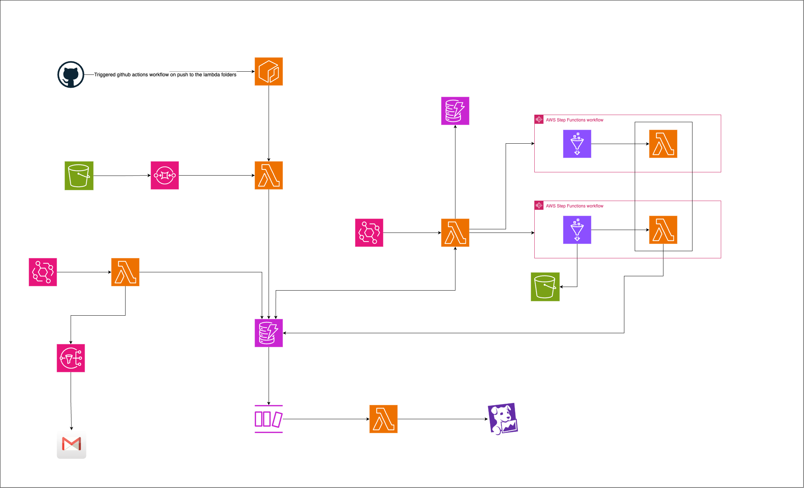
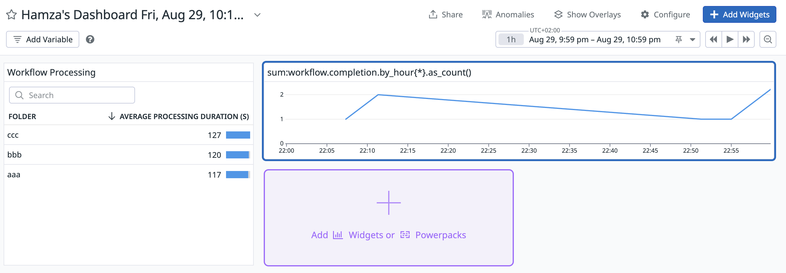

#### Part 6 - Datadog/Lambda monitoring feature

## NOTE: THIS README WAS WRITTEN MANUALLY WITHOUT THE USE OF ANY AI TOOL. PLEASE TAKE THE TIME TO READ IT CAREFULLY, AS I PUT EFFORT INTO WRITING IT.

**Note:** Make sure to check out the [Version 1 repository](https://github.com/hamzabel99/Data_Ingestion_V1), the [Version 2 repository](https://github.com/hamzabel99/Data_Ingestion_V2), the [Version 3 repository](https://github.com/hamzabel99/Data_Ingestion_V3), the [Version 4 repository](https://github.com/hamzabel99/Data_Ingestion_V4) and the [Version 5 repository](https://github.com/hamzabel99/Data_Ingestion_V5) first, as it’s essential to understand the foundation before diving into Version 6.

For the 6th version, I added a new monitoring feature using Datadog.
This works through a Lambda function that is triggered by a DynamoDB stream whenever an item in the workflow_status_table is updated, specifically when the workflow_status changes from Processing to Done. This allows the Lambda function to detect any newly processed files, calculate custom metrics, and send them to Datadog.

For example, the custom metrics allow us to:

    - Track the number of processed files by file type, source bucket, folder, prefix, and hour.

    - Measure the average processing time by file type, source bucket, folder, prefix, and hour.

    - Monitor the total size of ingested data by file type, source bucket, folder, prefix, and hour.

    - Measure the duration between file upload and the completion of ingestion.

How is the project evoluating so far : 

    - Version 1 : A first mvp pipeline that ingest single files.
    - Version 2 : Decoupled the pipeline into two phases to allow the workflow to batch process the files rather than just processing one file at a time.
    - Version 3 : Added an enhancement to the pipeline that allowed us to get daily monitor reports about the files that didn't get processed yet.
    - Version 4 : Refactoring the Terraform code for multi-environment deployment.
    - Version 5 : Adding Github Actions automation workflows for build and push docker images
    - Version 6 : Added a monitoring feature with datadog that gather information about files ingestion

Ideas for the next versions : More Monitoring and CloudWatch alarms, Athena Tables to query data, Add new workflow that don't necessary ingest data through Glue Jobs but uses some AI model to classify images for example.

