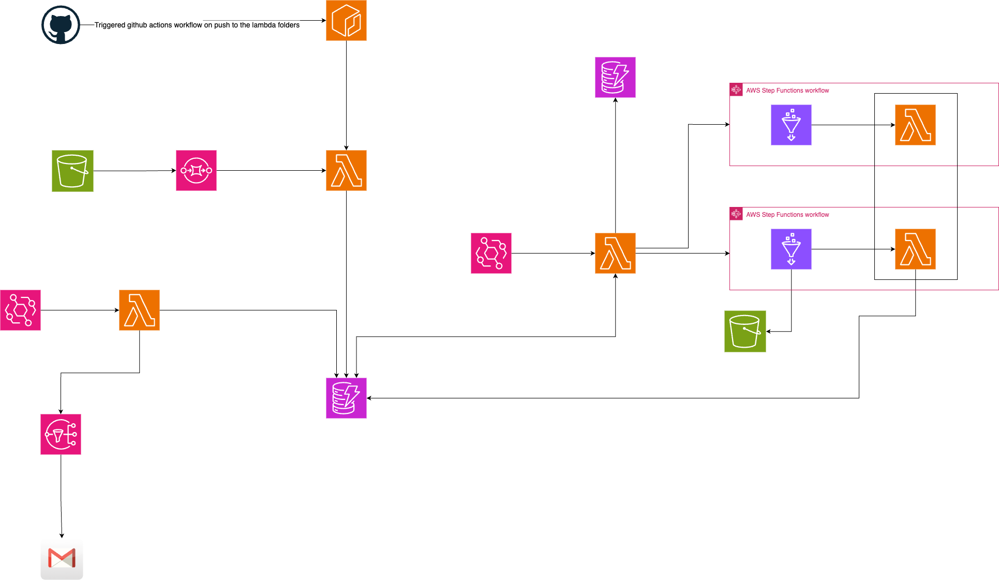
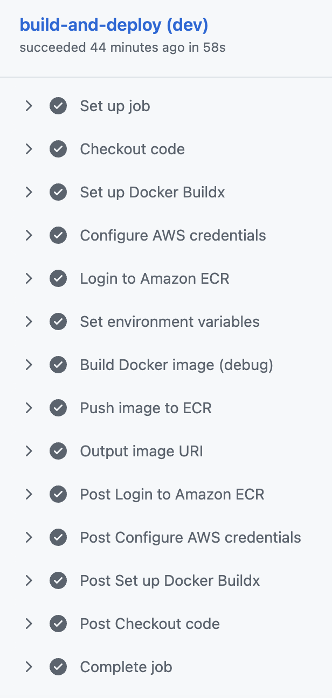

#### Part 5 - Github Actions workflow for building and pushing Docker images for Lambda functions

## NOTE: THIS README WAS WRITTEN MANUALLY WITHOUT THE USE OF ANY AI TOOL. PLEASE TAKE THE TIME TO READ IT CAREFULLY, AS I PUT EFFORT INTO WRITING IT.

**Note:** Make sure to check out the [Version 1 repository](https://github.com/hamzabel99/Data_Ingestion_V1) and the [Version 2 repository](https://github.com/hamzabel99/Data_Ingestion_V2) and the [Version 3 repository](https://github.com/hamzabel99/Data_Ingestion_V3) and the [Version 4 repository](https://github.com/hamzabel99/Data_Ingestion_V4) and the [Version 3 repository](https://github.com/hamzabel99/Data_Ingestion_V3) first, as it’s essential to understand the foundation before diving into Version 5.

For the 5th version, the Lambda functions are now deployed using a Docker image instead of a classic zipped Python package. The previous approach was fully functional, and we could have kept it since the Lambda functions’ dependencies are not too large. However, I chose this deployment method in order to introduce at least four different CI/CD workflow automations through GitHub Actions in the project.

How is the project evoluating so far : 

    - Version 1 : A first mvp pipeline that ingest single files.
    - Version 2 : Decoupled the pipeline into two phases to allow the workflow to batch process the files rather than just processing one file at a time.
    - Version 3 : Added an enhancement to the pipeline that allowed us to get daily monitor reports about the files that didn't get processed yet.
    - Version 4 : Refactoring the Terraform code for multi-environment deployment.
    - Version 5 : Adding Github Actions automation workflows for build and push docker images

Ideas for the next versions : More Monitoring and CloudWatch alarms, Athena Tables to query data, Add new workflow that don't necessary ingest data through Glue Jobs but uses some AI model to classify images for example.

